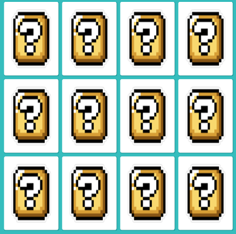
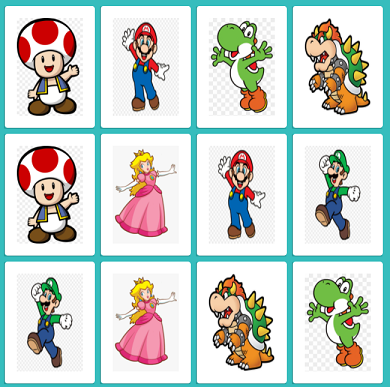
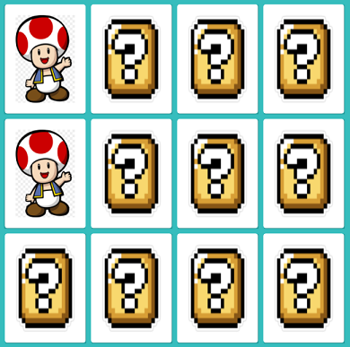

# Mario Memory Game
Pequena modificação do código apresentado no Lab **"Desenvolvendo um jogo da memória"** da [Digital Innovation One](https://digitalinnovation.one).

## Modificações
Para dar a oportunidade do jogador fazer uma memorização inicial, todas as cartas são reveladas por poucos segundos no início do jogo.

## Instruções
Para iniciar o jogo da memória, abra o `index.html` no seu navegador da web.
Clique nas cartas e tente fazer os pares.

## Tecnologias utilizadas
- HTML
- CSS
- JavaScript

## Screenshots

